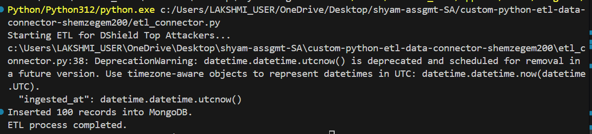
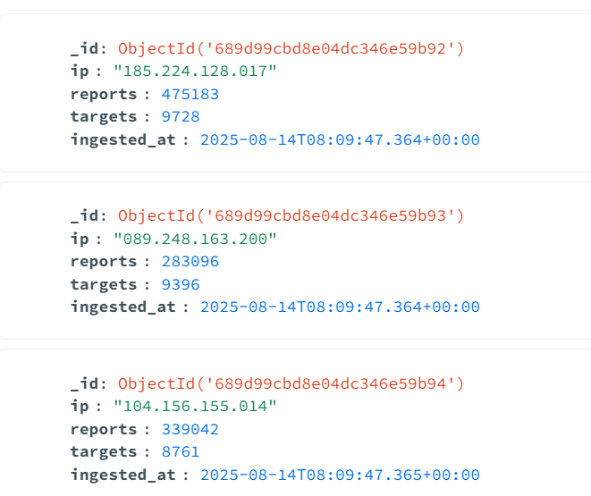

# 📊 ETL Connector – DShield → MongoDB

This project extracts cybersecurity threat intelligence data from the **DShield API**, transforms it, and loads it into **MongoDB** for analysis and storage.  

---

## 🚀 Features
- **Extract**: Fetches the top suspicious IPs from DShield.
- **Transform**: Cleans, structures, and enriches the data.
- **Load**: Stores the processed data into MongoDB.
- Works with **local MongoDB** or **MongoDB Atlas**.

---

## 🛠 Requirements
- **Python** `3.9+`
- **MongoDB** (Local or Cloud)
- `pip install -r requirements.txt`

---

## ⚙️ Setup Instructions

### 1️⃣ Clone the Repository
```bash
git clone https://github.com/shemzegem200/custom-python-etl-data-connector-shemzegem200.git
```

### 2️⃣ Install Dependencies
```bash
pip install -r requirements.txt
```

### 3️⃣ Configure Environment Variables
Create a `.env` file in the project root:
```env
MONGO_URI=mongodb+srv://<username>:<password>@cluster.mongodb.net
BASE_URL=Base url
ENDPOINT=Endpoint
```

---

## ▶️ Run the ETL Script
```bash
python etl_connector.py
```

---

## ✅ Verifying the Data

1. **Open MongoDB Compass** (or Atlas Web UI)  
2. Connect using your **MONGO_URI**  
3. Navigate to your database (`security_data`)  
4. Open the `dshield_top_attackers_raw` collection  
5. 🎉 Check for newly inserted records  

---

## 📂 Project Structure
```
.
├── .github
├── etl_connector.py     # Main ETL pipeline script
├── requirements.txt     # Python dependencies
└── README.md            # Documentation
```

## Output Screenshots




---
